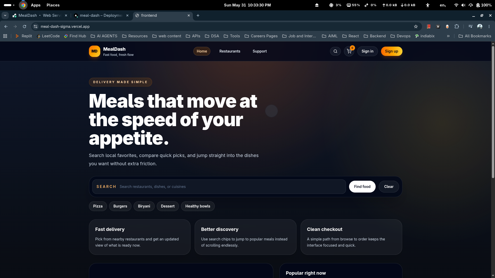
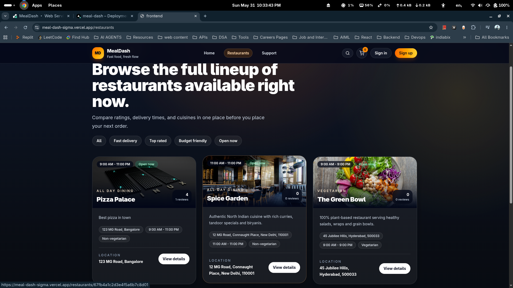
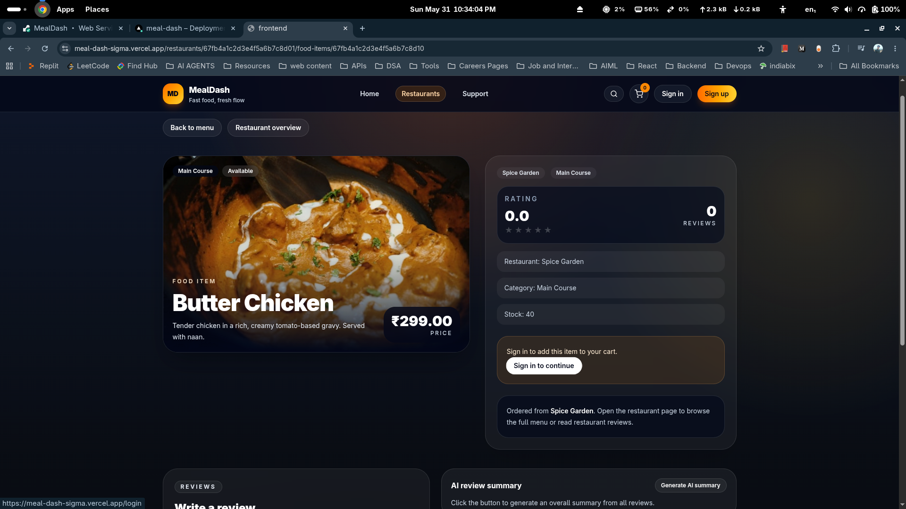

# MealDash

MealDash is a full-stack food ordering platform with a modern React frontend and a scalable Node.js/Express backend. It supports restaurant browsing, menu exploration, cart and checkout flows, order management, role-based access, image uploads, AI-assisted content, and Stripe payments.

## Table of Contents

1. [Overview](#overview)
2. [Key Features](#key-features)
3. [Product Screens](#product-screens)
4. [Tech Stack](#tech-stack)
5. [Project Structure](#project-structure)
6. [Getting Started](#getting-started)
7. [Environment Variables](#environment-variables)
8. [Running the Project](#running-the-project)
9. [Deployment](#deployment)
10. [Security Notes](#security-notes)
11. [License](#license)

## Overview

MealDash is designed as a two-part architecture:

- Frontend: React + Vite application for customer and admin experiences.
- Backend: Express API with MongoDB, authentication, payment, media upload, and AI service integrations.

This architecture allows each service to be deployed independently for better scaling and operational flexibility.

## Key Features

- User authentication and secure JWT-based sessions via HTTP-only cookies.
- Restaurant and menu browsing with food item detail pages.
- Cart operations: add, update quantity, remove, and clear items.
- Order lifecycle management for customers, restaurant owners, and admins.
- Stripe checkout session creation with webhook handling.
- Cloudinary-powered media handling for food, restaurant, and avatar images.
- AI-powered generation/summarization workflows for menu and reviews.
- Role-aware routes and admin operations.

## Product Screens

### Home Page



### Restaurant Page



### Food View Page



## Tech Stack

### Frontend

- React 19
- Vite
- React Router
- Redux Toolkit
- Axios
- Tailwind CSS

### Backend

- Node.js
- Express
- MongoDB + Mongoose
- JWT Authentication
- Stripe SDK
- Cloudinary SDK
- Nodemailer

## Project Structure

```text
MealDash/
├── backend/
│   ├── public/
│   │   ├── images/
│   │   └── temp/
│   └── src/
│       ├── controllers/
│       ├── middleware/
│       ├── models/
│       ├── routes/
│       ├── services/
│       ├── utils/
│       └── app.js
├── frontend/
│   └── src/
│       ├── components/
│       ├── pages/
│       ├── redux/
│       └── utils/
└── README.md
```

## Getting Started

### Prerequisites

- Node.js 18+
- npm 9+
- MongoDB Atlas (or compatible MongoDB deployment)

### Clone and Install

```bash
git clone https://github.com/manas-techie/MealDash.git
cd MealDash

cd backend
npm install

cd ../frontend
npm install
```

## Environment Variables

Create environment files for backend and frontend.

### Backend (`backend/src/config/config.env`)

```dotenv
PORT=3000
MONGO_URI=<your-mongodb-uri>
CORS_ORIGIN=<your-frontend-origin>
FRONTEND_URL=<your-frontend-url>

JWT_SECRET=<strong-secret>
JWT_EXPIRE=7d
JWT_EXPIRES_TIME=7
NODE_ENV=DEVELOPMENT

CLOUDINARY_CLOUD_NAME=<cloudinary-cloud-name>
CLOUDINARY_API_KEY=<cloudinary-api-key>
CLOUDINARY_API_SECRET=<cloudinary-api-secret>

EMAIL_HOST=<smtp-host>
EMAIL_PORT=<smtp-port>
EMAIL_USER=<smtp-user>
EMAIL_PASS=<smtp-password>
EMAIL_FROM=<from-email>

STRIPE_SECRET_KEY=<stripe-secret-key>
STRIPE_PUBLISHABLE_KEY=<stripe-publishable-key>
STRIPE_WEBHOOK_SECRET=<stripe-webhook-secret>

GROQ_API_KEY=<groq-api-key>
```

### Frontend (`frontend/.env.local`)

```dotenv
VITE_NODE_ENV=development
VITE_API_URL=http://localhost:3000/api/v1
```

## Running the Project

Run backend:

```bash
cd backend
npm run dev
```

Run frontend:

```bash
cd frontend
npm run dev
```

Build frontend for production:

```bash
cd frontend
npm run build
```

## Deployment

Recommended production split deployment:

- Backend: Render
- Frontend: Vercel

### Backend on Render

Set environment variables in Render dashboard (do not depend on local config files in production).

- `CORS_ORIGIN=https://<your-vercel-domain>.vercel.app`
- `FRONTEND_URL=https://<your-vercel-domain>.vercel.app`
- `NODE_ENV=PRODUCTION`
- Plus all required service keys (MongoDB, Cloudinary, Stripe, Email, Groq, JWT).

### Frontend on Vercel

Project settings:

- Root Directory: `frontend`
- Build Command: `npm run build`
- Output Directory: `dist`

Environment variables:

- `VITE_API_URL=https://<your-render-backend>.onrender.com/api/v1`
- `VITE_NODE_ENV=production`

For SPA refresh routes, add `frontend/vercel.json`:

```json
{
  "rewrites": [
    {
      "source": "/(.*)",
      "destination": "/index.html"
    }
  ]
}
```

## Security Notes

- Never commit real credentials to git.
- Rotate any exposed API keys immediately.
- Use per-environment secrets in Render/Vercel dashboards.
- Keep `CORS_ORIGIN` strict in production; avoid `*` for credentialed requests.

## License

This project is licensed under the MIT License. See the `LICENSE` file for details.
